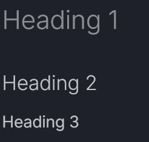

# Markdown Cheatsheet
I haven't used markdown in quite some time,
And now I have MkDocs / MkDocs-Material.

Let's see what we can do with these new toys.

## 1. Headings

### Syntax:
```
# Heading 1    
## Heading 2  
### Heading 3
```

### Output:

!!! note     
    *This is an image ; output of a level 1 heading at this point would f. up the table of content*



---

## 2. Line Break

### Syntax:
* Using two spaces before return to force ```  ``` a new line.  
* Using explicit ```<br>``` tag to force a new line.  

### Output:
* Using two spaces before return to force  
  a new line.  
* Using explicit ```<br>``` tag to force <br> a new line.  

---

## 3. Bold & Italic Text

### Syntax:
* ```**Bold text**```  
* ```*Italic text*```  
* ```***Bold and Italic***```
### Output:
* **Bold text**  
* *Italic text*  
* ***Bold and Italic***  

---

## 4. Lists 

### Unordered Lists
#### Syntax:

- ```- Item 1``` (bullet can be either ```-```, ```+``` or ```*```)
- ```+ Item 2```
- ```....* Nested Item``` (indent = space x4)

#### Output:
- Item 1
+ Item 2
    * Nested Item

### Ordered Lists
#### Syntax:
- ```1. First Item```
- ```2. Second Item```
- ```....1. First nested Item``` (indent = space x4) 
- ```....2. Second nested Item```

#### Output:
1. First item
2. Second item
    1. First nested Item (auto-numbering corrected to ```a, b, ...```)
    2. Second nested Item

---

## 5. Links

### Syntax:
- ```[Displayed Text](Actual link)```
- ```[Visit Google](https://www.google.com)``` *(link to a website)*
- ```[Return to Index](index.md)``` *(link to another file)*
- ```[Visit 'Line Break' section](cheat_sheet.md#2-line-break)``` *(link to a specific header in a file)*

### Output:
- [Visit Google](https://www.google.com)
- [Return to Index](index.md)
- [Visit 'Line Break' section](cheat_sheet.md#2-line-break)

---

## 6. Images 

### Syntax:
- ``````
- ``````
- ``````

### Output:
- 
- 

---

## 7. Code Blocks

### Syntax:
This is ``` ` ```inline code``` ` ``` in the middle of a sentence. (back tick : ctrl + alt + 7)
````
```
This is  
    multi-line  
    code block
```
````
````
``` python title="Code block with syntax highlighting"
print("Hello, World!")
```
````
!!! note ""  
    Lexers list : ps1, Bash, md, python, [etc...](https://pygments.org/docs/lexers/#pygments.lexers.markup.MarkdownLexer) 

***TODO : Add example of code block with line highlighting.***

### Output:
This is `inline code` in the middle of a sentence.  

```
This is  
    multi-line  
    code block
```

``` python title="Code block with syntax highlighting"
print("Hello, World!")
```

---

## 8. Tables

### Syntax:
***TODO : redo section + include tabs***
### Output:
| Column 1 | Column 2 |
|-|-|
| Data 1 | Data 2 |

---

## 9. Horizontal Line  

### Syntax:
```---```
### Output:
---

---


## 10. Admonitions & Collapsible Sections 

### Syntax:

**List of admonition tags** : *note, abstract, info, tip, success, question, warning, failure, danger, bug, example and quote*.  

``` md title="Markdown"
!!! note ""
    No title means no icon, color stays though.  
    But don'ton't forget the quotes.
```

``` md title="Markdown"
??? warning "No title gets an ugly result in collapsibles"
    Lorem ipsum dolor sit amet, consectetur adipiscing elit.
```

``` md title="HTML"
<details>
  <summary>Click to expand</summary>
  Using HTML !
</details>
```


### Output:

!!! note ""
    No title means no icon, color stays though.  
    But don't forget the quotes.

??? warning "No title gets an ugly result in collapsibles"
    Lorem ipsum dolor sit amet, consectetur adipiscing elit.

<details>
  <summary>Click to expand</summary>
  Using HTML !
</details>

---

## 11. Tooltips & Annotations

### Syntax:

```md title="Simple hover tooltip"
This tooltip example uses the *title attribute*{ title=  
 "However it necessitates an extra css rule to get the underline and mouse cursor."  
 }.
```
```md title="Single annotation"
Lorem ipsum dolor sit amet, (1) consectetur adipiscing elit.
{ .annotate }

1. I'm an annotation! I can contain `code`, __formatted
    text__, images, ... basically anything that can be expressed in Markdown.
```
```md title="Annotations in a list requiere the use of HTML and the attr_list extension"
<div class="annotate" markdown>
+ Etiam laoreet mattis quam eget vehicula. (1)
+ In nunc sem, bibendum in ante a (2), ultrices iaculis dolor.
</div>

1. I'm another annotation ! I can contain `code`, __formatted
    text__, images, ... basically anything that can be expressed in Markdown.
2.  I'm an annotation too !
```
!!! warning "Correct placement for annotations"
    Material for Mkdocs will try and hide the annotations.  
    Therefore they must always be placed in the last position in a bloc (end of section, end of page).  
    Everything after will also be hidden.

### Output:

This tooltip example uses the *title attribute*{ title="However it necessitates an extra css rule to get the underline and mouse cursor." }.


Lorem ipsum dolor sit amet, (1) consectetur adipiscing elit.
{ .annotate }

1. I'm an annotation ! I can contain `code`, __formatted
    text__, images, ... basically anything that can be expressed in Markdown.

**Annotations within a list :** 
<div class="annotate" markdown>
+ Etiam laoreet mattis quam eget vehicula. (1)
+ In nunc sem, bibendum in ante a (2), ultrices iaculis dolor.
</div>

1. I'm another annotation ! I can contain `code`, __formatted
    text__, images, ... basically anything that can be expressed in Markdown.
2.  I'm an annotation too !

---

## 12. Icons & Emojis

Coming soon:material-trademark: <-- this is an icon :wink:
