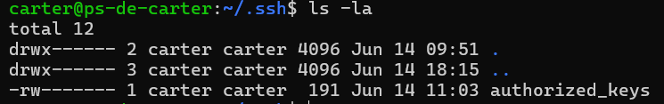

# SSH

## 1. Introduction

+ A la fin de l'installation de Debian, nous avons demandé l’activation d'un serveur SSH, un protocole de communication indispensable pour piloter la machine à distance en mode headless.
+ Ce protocole constituant un point d’entrée crucial vers le serveur, il est essentiel d’en limiter et d’en sécuriser l’accès autant que possible.
+ Cette page couvre la configuration du service SSH côté serveur, ainsi que sa sécurisation : paires de clefs chiffrées, règles de firewall, restrictions diverses...
+ On suppose que durant l'installation de Debian, le compte root a bien été désactivé au profit d'un nouvel utilisateur avec un mot de passe. 
 
---

## 2. Planification

Lorem ipsum dolor sit amet, (1) consectetur adipiscing elit.
{ .annotate }

+ L'objectif principal est qu'à la fin de ce tutoriel, l'accès en SSH à la machine soit **restreint à un seul utilisateur, non root, authentifié de façon unique par une clef privée et situé sur le réseau local**.

!!! warning
    La sécurisation du serveur SSH et de la machine va se faire en plusieures étapes, afin de ne pas perdre l'accès par excès de zèle (et devoir brancher un écran et un clavier pour réparer).

* **Objectifs :** Quels étaient vos objectifs précis pour cette mise en œuvre ?
* **Solutions alternatives envisagées (et pourquoi ce choix) :** Très utile pour référence future. Pourquoi avoir choisi `mkdocs` plutôt que `sphinx`, ou l’authentification par clé SSH plutôt que par mot de passe ?
* **Architecture système / Schéma réseau (si applicable) :** Un simple diagramme (utilisable via Mermaid.js dans Material for MkDocs) peut clarifier les configurations complexes.

Lorem ipsum dolor sit amet, (1) consectetur adipiscing elit.
{ .annotate }

1.  I'm an annotation! I can contain `code`, __formatted
    text__, images, ... basically anything that can be expressed in Markdown.
---

## 3. Étapes de mise en œuvre

Cette section doit être un tutoriel clair et progressif. Chaque étape contient un objectif et les commandes nécessaires.

### 3.1. [Sous-sujet 1 : par ex., Installation des paquets nécessaires]

* **Objectif :** Que cherchez-vous à accomplir à cette étape ?
* **Explication :** Pourquoi ces paquets sont-ils nécessaires ? Que font ces commandes ?
* **Commandes :** Utilisez des blocs de code avec coloration syntaxique. Précisez si des droits root sont requis.
    ```bash
    sudo apt update
    sudo apt install <nom-du-paquet> # Pourquoi ce paquet est requis
    ```
* **Sortie attendue (optionnel mais utile) :** Affichez un extrait ou un exemple de la sortie attendue pour guider le lecteur.
    ```
    Exemple de sortie...
    ```
* **Remarques / Dépannage :** Considérations spécifiques, problèmes fréquents, ou astuces utiles.

### 3.2. [Sous-sujet 2 : par ex., Configuration]

* **Objectif :** Quelle configuration mettez-vous en place ?
* **Explication :** Précisez le rôle des fichiers de configuration, les paramètres spécifiques et leurs effets.
* **Commandes (édition de fichiers) :**
    ```bash
    sudo nano /etc/config/fichier.conf
    ```
* **Contenu du fichier (utiliser un bloc code avec `linenums` et `hl_lines`) :**
    ```ini linenums="1" hl_lines="5 7-8"
    # Exemple de fichier de configuration
    [Section]
    Parametre1 = valeur1
    # Cette ligne est importante
    Parametre2 = valeur2 # Cette valeur permet de faire X
    AutreParam = 0
    # Activer ceci pour Y
    EncoreUn = true
    ```
* **Commandes de validation (ex. : `systemctl status`) :**
    ```bash
    systemctl status nom-du-service
    ```
* **Sortie attendue :**
    ```
    ● nom-du-service.service - Description
         Chargé : chargé (/lib/systemd/system/nom-du-service.service; activé; preset : activé)
         Actif : actif (en fonctionnement) depuis ...
    ```
* **Remarques / Dépannage :** Comme ci-dessus, partagez vos réflexions ou pièges courants.

---

## 4. Vérification / Tests

* **Comment vérifier que tout fonctionne :** Commandes ou étapes de test.
    ```bash
    ssh utilisateur@ip-du-serveur # Pour tester la connexion SSH
    ```
* **Résultat attendu :** Que devrait-on voir ou constater si tout fonctionne correctement ?

---

## 5. Utilisation quotidienne (si applicable)

* **Commandes courantes :** Pour les opérations quotidiennes (ex. : consulter les logs SSH, ajouter une clé).
    ```bash
    journalctl -u sshd.service
    ```
* **Astuces :** Bonnes pratiques, raccourcis utiles, etc.

---

## 6. Maintenance / Évolutions futures

* **Sauvegardes :** Comment sauvegarder les fichiers ou configurations importants.
* **Mises à jour du service / paquet :** Comment assurer le suivi et la mise à jour.
* **Problèmes potentiels :** Problèmes prévisibles et solutions associées.
* **Évolutivité / Améliorations futures :** Pistes d’évolution, d’optimisation ou d’extension.

---

## 7. Ressources / Liens utiles

* **Documentation officielle :** Man pages, docs officielles du projet, etc.
* **Articles / tutoriels pertinents :** Sources externes ayant aidé.
* **Pages liées :** Liens vers d’autres pages de votre propre documentation.

---

## 8. Journal des modifications

* **Date :** Modifications apportées.
    * 27-06-2025 : Application du pattern.
    
    
    
But sécuriser l'accès en ssh.  

on peut créer une paire de clés publiques/privées

On se co en ssh avec password avec le compte créé durant l'install
``` ps1 title="Powershell"
ssh carter@ps-de-carter
```

## Private / Public Keys

### Préparation côté linux
Créa du dossier à l'emplacement classique (dans le dossier utilisateur, là où ssh va chercher les clefs)
``` bash title="Bash"
mkdir -p ~/.ssh
touch ~/.ssh/authorized_keys
```
Gestion des permissions. /!\ le dossier ET le fichiers doivent appartenir à l'utilisateur
``` bash title="Bash"
chmod 700 ~/.ssh
chmod 600 ~/.ssh/authorized_keys
```
A la fin, on doit obtenir ça : 


### Créa des clefs sous windows
openSSH est déjà installé sur windows 11, on peut donc l'utiliser pour générer les paires de clefs.
``` ps1 title="Powershell"
ssh-keygen -t ed25519 -C "sp9-de-carter"
```
On enregistre sur place (.ssh) à coté du fichier host, sans passphrase.
On se retrouve avec 2 fichiers id_ed25519 et id_ed25519.pub (la clef publique)

Si on veut des clefs sur une autre machine, ne pas oublier de changer le label.

### Copie des clefs dans authorized_keys

copie directe depuis windows, ```>>``` concatène donc pas de soucis pour rajouter des clefs supplémentaries avec la même commande.

``` ps1 title="Powershell"
type $env:USERPROFILE\.ssh\id_ed25519.pub | ssh carter@ps-de-carter "cat >> .ssh/authorized_keys"
```

*On peut sinon, ouvrir le fichier .pub, copier le contenu et le coller dans la fentre de terminal après avoir ouvert authorized_keys avec nano.*

### Activation et Test
Pour pouvoir se co avec des clefs publiques uniquement il faut editer le fichier de config du server ssh.

``` bash title="Bash"
sudo nano /etc/ssh/sshd_config
```

On va activer les lignes suivantes (en enlevant le ```#``` de commentaire)

``` bash title="sshd_config"
PubkeyAuthentication yes
AuthorizedKeysFile .ssh/authorized_keys
```

On redémarre le service
``` bash title="Bash"
sudo systemctl restart ssh
```

Si on peut se co sans mettre de password avec juste ```ssh carter@ps-de-carter``` alors l'authentification par clefs fonctionne et on peut passer à la suite.

## IP Fixe
Si le server est bien en ip fixe, on peut restreindre ssh a cette seule interface.

Mais, l'obtention d'une IP fixe par le router n'est pas suffisante (peut arriver trop tard) ; de plus si on confie le service DHCP à pi-hole plus tard on devra aussi déclarer une IP fixe.  

Donc on modifie les interfaces pour passer en static.
``` bash title="Bash"
sudo nano /etc/network/interfaces
```
``` bash title="interfaces"
# après 'allow-hotplug enp0s31f6'
# remplacer 'iface enp0s31f6 inet dhcp' par
iface enp0s31f6 inet static
    address 192.168.1.69
    netmask 255.255.255.0
    gateway 192.168.1.1
    dns-nameservers 1.1.1.1 8.8.8.8
```
**Attention aux valeurs réelles des interfaces et IPs !**

## Config

On peut continuer l'édition de ```sshd_config```.  
Maintenant qu'on sait que les clefs fonctionnent, on va virer la co par password.

``` bash title="sshd_config"
PasswordAuthentication no
PermitRootLogin no
KbdInteractiveAuthentication no # anciennement ChallengeResponseAuthentication
UsePAM no
# le server est en ip fixe et on ne veut pas qu'il écoute sur une autre interface
ListenAddress 192.168.1.69
# On pourrait vouloir rajouter une interface pour les accès via wireguard
# ListenAddress 10.qqchose
# attention au changement de num de port !
Port 2357
```

On restart et on teste, il faut mainteantn préciser le num de port pour se co.
``` ps1 title="Powershell"
ssh -p 2357 carter@ps-de-carter
```

Next : [Hardening part 1](hardening_1.md)
